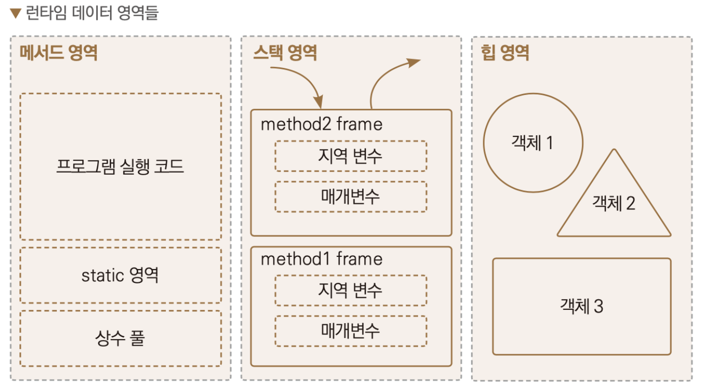

https://github.com/soljeong/private/commit/7398633bd89ca05c0a2a0123aacd230f729680f5

- singleton design pattern
- 싱글톤 디자인 패턴, 하나만 생성하고 재사용한다.
- new 로 새 인스턴스를 만들지 않고
- static에서 해결한다
- 힙에서는 가비지컬랙터가 작동하지만, 메서드에서는 그렇지 않다. 메모리 관리 필요.
- 힙에서는 this가 필요하지만, static에서는 필요하지 않다.
> 사용해야 할 이유 아직 모름
