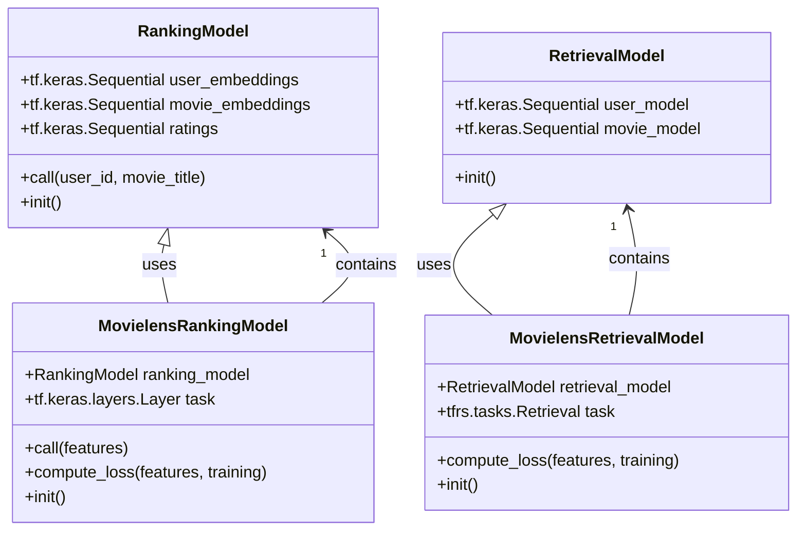

## 수업
1. SQL 수업, 추천시스템 코드 분석
2. SQL DDL(Data Definition Language)
3. 행렬분해 코드 분석
4. 추천시스템 쉬운것부터 해봅시다.
5. 추천시스템 컨텐츠기반추천부터, CBF 하라니까 왜 CF를 보고 있어
6. 피처 더 세분화 -> 지금 이게 문제가 아니구나 모델을 먼저.
7. 진도 전혀 안나가네 정말
8. 다시 구글 코드로 돌아옴
9. 
## SQL
### DDL(Data Definition Language) [[DDL]]
- 
## 추천시스템
- 결국 이거 곱하는게 핵심인것 같은데?
```
predictions = (user_embedded * movie_embedded).sum(1)
```

### 텐서플로로 작성된 코드를 파이토치로 바꿔달라고 챗지피티한테
TensorFlow 코드를 PyTorch로 변환하기 위해, 몇 가지 주요 변경점을 고려해야 합니다. PyTorch에서는 모델 구조, 손실 함수 계산, 그리고 훈련 루프가 TensorFlow와 다르게 구현됩니다. PyTorch는 동적 계산 그래프를 사용하며, 자동 미분 및 GPU 가속을 더 직관적으로 다룰 수 있습니다.

변환된 코드는 다음과 같습니다:

1. **`sparse_mean_square_error` 함수를 PyTorch로 변경:**

   이 함수는 사용자 및 영화 임베딩을 이용해 예측값을 계산하고, 실제 평점과의 평균 제곱 오차(MSE)를 반환합니다.

   ```python
   def sparse_mean_square_error_pytorch(sparse_ratings, user_embeddings, movie_embeddings):
       # 예측값 계산
       user_embedded = user_embeddings[sparse_ratings._indices()[0]]
       movie_embedded = movie_embeddings[sparse_ratings._indices()[1]]
       predictions = (user_embedded * movie_embedded).sum(1)

       # 실제값
       targets = sparse_ratings._values()

       # 평균 제곱 오차 계산
       loss = torch.mean((predictions - targets) ** 2)
       return loss
   ```

2. **`CFModel` 클래스를 PyTorch로 변경:**

   PyTorch 버전의 `CFModel` 클래스는 모델의 임베딩 변수, 손실 함수, 그리고 훈련 루프를 관리합니다.

   ```python
   class CFModelPyTorch:
       def __init__(self, embedding_vars, loss_fn, metrics=None):
           self.embedding_vars = embedding_vars
           self.loss_fn = loss_fn
           self.metrics = metrics or {}
           self.optimizer = None

       def train(self, num_iterations, learning_rate):
           self.optimizer = torch.optim.SGD(self.embedding_vars.values(), lr=learning_rate)
           for i in range(num_iterations):
               self.optimizer.zero_grad()
               loss = self.loss_fn()
               loss.backward()
               self.optimizer.step()

               if i % 100 == 0:
                   print(f"Iteration {i}: Loss = {loss.item()}")
                   for name, metric in self.metrics.items():
                       print(f"{name}: {metric()}")
   ```

3. **`build_model` 함수를 PyTorch로 변경:**

   이 함수는 훈련 및 테스트 데이터셋을 생성하고, 모델을 초기화하며, `CFModelPyTorch` 객체를 반환합니다.

   ```python
   def build_model_pytorch(ratings, embedding_dim=3, init_stddev=1.):
       train_ratings, test_ratings = split_dataframe(ratings)
       A_train = build_rating_sparse_tensor_pytorch(train_ratings)
       A_test = build_rating_sparse_tensor_pytorch(test_ratings)

       U = torch.randn([A_train.shape[0], embedding_dim], dtype=torch.float32) * init_stddev
       V = torch.randn([A_train.shape[1], embedding_dim], dtype=torch.float32) * init_stddev

       def train_loss_fn():
           return sparse_mean_square_error_pytorch(A_train, U, V)

       def test_loss_fn():
           return sparse_mean_square_error_pytorch(A_test, U, V)

       metrics = {'train_loss': train_loss_fn, 'test_loss': test_loss_fn}
       return CFModelPyTorch({'user': U, 'movie': V}, train_loss_fn, metrics)
   ```

4. **훈련 데이터셋을 PyTorch Sparse Tensor로 변환하는 함수를 추가합니다:**

   ```python
   def build_rating_sparse_tensor_pytorch(ratings_df):
       indices = torch.LongTensor(ratings_df[['user_id', 'movie_id']].values)
       values = torch.FloatTensor(ratings_df['rating'].values)

       return torch.sparse.FloatTensor(indices.t(), values, torch.Size([ratings_df['user_id'].nunique(), ratings_df['movie_id'].nunique()]))
   ```

5. **모델을 생성하고 훈련합니다:**

   ```python
   model = build_model_pytorch(ratings, embedding_dim=30, init_stddev=0.5)
   model.train(num_iterations=1000, learning_rate=10.)
   ```

위의 PyTorch 코드는 TensorFlow의 기능을 활용하는 대

신 PyTorch의 기능을 이용하여 임베딩, 손실 계산 및 최적화를 수행합니다. 이 코드는 PyTorch의 특성을 최대한 활용하여 작성되었습니다.
## 행렬 분해
- [[추천 시스템 Matrix factorization  네이버 블로그]]
- https://soobarkbar.tistory.com/105
	- 이론적인 내용, 이것만 구현할 수 있으면 되는데
- https://heegyukim.medium.com/
	- 이 블로그에 내용 쉬운 순서로 똑같이 따라하기
- 컨텐츠 기반 추천 구현하기
	- https://github.com/HeegyuKim/RecSys-MovieLens100k/blob/main/notebooks/Classic%20Recommendations.ipynb
	- 아이템 하나를 정하면, 그것과 비슷한 아이템을 추천한다.
	- 유저별 아이템이 두개씩만 주어진 경우가 많으니까 이것도 나쁘지 않은듯?
	- 유저별 아이템이 두개 이상인 경우 뭘 기준으로 할지? 여러개 계산해서 더한다?

### 코사인 유사도로 추천 점수 계산
- 아래 코드에서 나누기 하나 안하나 똑같은 점수, 스케일링 할 필요 없다.
```python
# 사용자-아이템 행렬 생성: 구직자가 해당 채용 공고에 지원했으면 1, 아니면 0으로 설정
user_item_matrix = apply_train_df.groupby(['resume_seq', 'recruitment_seq']).size().unstack(fill_value=0)
user_item_matrix[user_item_matrix > 1] = 1

# 사용자 간의 유사성 계산
user_similarity = cosine_similarity(user_item_matrix)

# 추천 점수 계산
user_predicted_scores = user_similarity.dot(user_item_matrix) / np.array([np.abs(user_similarity).sum(axis=1)]).T
# user_predicted_scores = user_similarity.dot(user_item_matrix)
```
- user-item mat + user feat (가로로) -> 코사인 유사도 -> 유저간 유사도
	- user-feat 개수보다 item 개수가 훨씬 많기 때문에, 비중이 낮게 잡히지 않을지
- item feat -> 코사인 유사도 -> 아이템간 유사도
- user sim * user-item mat * item sim : 추천 점수
- 역시 하지 말 걸 그랬어. 점수도 안내보고 중도 포기
- (user sim action + user sim feat ) * user item * item sim : 이걸 해볼까
### ncf
- https://doheelab.github.io/recommender-system/ncf_mf/
- 결국 내가 제일 오래 매달린 모델은 이건데
- sparse 매트릭스로 만든다고 해도 딱히 빨라질만한게 없네, 네거티브 샘플링 할때만 매트릭스 사용하고 다른때는 사용 안함