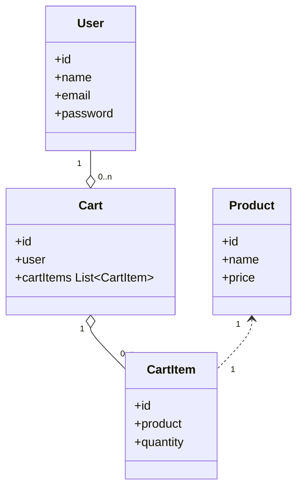

- 계정 가입 링크
- 로그인 링크
- 대소문자 제약 제거
## 아이디 1번인 유저에게 ADMIN ROLE 지정하기

```d2
product 1 -> cart 1 -> user 1
product 2 -> cart 1 
product 1 -> cart 2 -> user 1
product 2 -> cart 2 


product 1 -> cart 3 -> user 2
product 2 -> cart 3
product 1 -> cart 4 -> user 2
product 2 -> cart 4 

product 3 -> review 1 -> user 3
product 3 -> review 2 -> user 4
product 4 -> review 3 -> user 3
product 4 -> review 4 -> user 4


```

## jpa
mapped by를 하려면, 
Answer 엔티티 객체로 구성된 answerList를 속성으로 추가하고 @OneToMany 애너테이션을 설정했다. 이제 질문 객체(예:question)에서 답변을 참조하려면 `question.getAnswerList()`를 호출하면 된다. @OneToMany 애너테이션에 사용된 mappedBy는 참조 엔티티의 속성명을 의미한다. 즉, Answer 엔티티에서 Question 엔티티를 참조한 속성명 question을 mappedBy에 전달해야 한다.
https://wikidocs.net/161165

