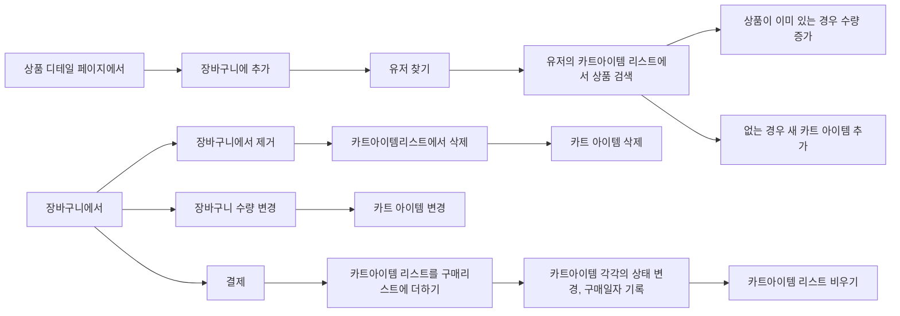

```d2
entity -> jpa -> DAO -> Service -> Controller
```
- 교재랑 똑같은 방법으로 먼저 구현
- dto 구현
# 가입페이지에서
 크롬브라우저가 회원가입 페이지를 자동으로 인식하여 비밀번호 추천 기능을 활성화하도록 하려면 다음과 같은 방법이 있습니다:

1. form 태그에 autocomplete="on" 속성 추가

```html
<form autocomplete="on">
  <!-- input elements here -->
</form>
```

2. 비밀번호 input에 name="password" 속성 지정

```html
<input type="password" name="password">
```

3. username 입력란에 name="username" 속성 지정

```html 
<input type="text" name="username">
```

이렇게 하면 크롬브라우저가 회원가입 페이지로 인식하고 자동으로 비밀번호 제안 기능을 활성화합니다. 

또한 HTTPS 프로토콜을 사용하는 것이 좋습니다. HTTPS를 사용하면 보안성이 높아지고, 브라우저와의 신뢰도가 올라가기 때문입니다.

# user role
- 아이디가 admin인 경우에 관리자 권한 부여
`[파일명:/sbb/src/main/java/com/mysite/sbb/answer/AnswerController.java]`

```java
(... 생략 ...)
import java.security.Principal;
(... 생략 ...)
public class AnswerController {

    (... 생략 ...)

    @PostMapping("/create/{id}")
    public String createAnswer(Model model, @PathVariable("id") Integer id, 
            @Valid AnswerForm answerForm, BindingResult bindingResult, Principal principal) {
        (... 생략 ...)
    }
}
```

현재 로그인한 사용자에 대한 정보를 알기 위해서는 스프링 시큐리티가 제공하는 Principal 객체를 사용해야 한다. 위와 같이 createAnswer 메서드에 Principal 객체를 매개변수로 지정하면 된다.

> `principal.getName()`을 호출하면 현재 로그인한 사용자의 사용자명(사용자ID)을 알수 있다.

- 관리자 권한에 따라 페이지 표시 여부
- 비로그인 유저 마이페이지로 주소 직접 입력해서 접속
- 마이페이지 접속했을 때 유저 이름 표시
# 접속 권한 제어
SecurityConfig에 적용한@EnableMethodSecurity 애너테이션의 `prePostEnabled = true` 설정은 QuestionController와 AnswerController에서 로그인 여부를 판별하기 위해 사용했던 @PreAuthorize 애너테이션을 사용하기 위해 반드시 필요하다.

이렇게 수정한후 로그아웃 상태에서 질문을 등록하거나 답변을 등록하면 자동으로 로그인 화면으로 이동하는 것을 확인할 수 있을 것이다.

- 카트의 결제 완료 여부 추가, 상태 변경
- 유저에게 새 카트 추가, 추가하기 전에 카트 목록 검사


```d2
notalone : {
  shape: sequence_diagram

  

  th: Thymeleaf

  con: MainController

  ser: Service

  re: Repository
}
```

