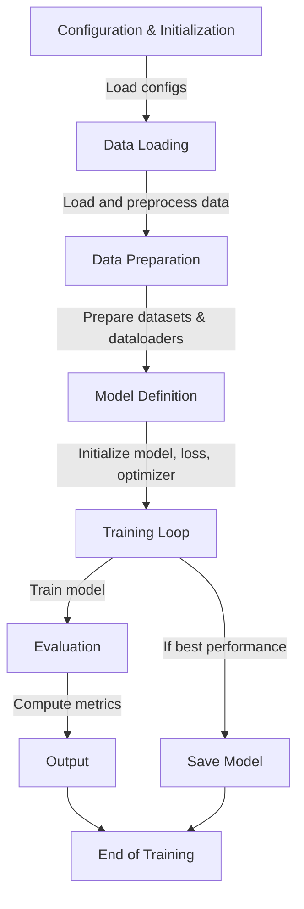

## csv 파일 업로드
- Advanced data analysis
## 코드 요청

Hello ChatGPT, I would like you to generate a Python script that performs the same functionality as a previous script I have. Here's what I need:

4. It should have functionality to load user and item features from separate CSV files, perform one-hot encoding on categorical variables, and concatenate them with other feature data.
5. There should be a custom PyTorch Dataset class that handles the loading of data and includes methods for negative sampling.
6. The script must include a DataLoader to batch and shuffle the dataset.
7. Define a PyTorch neural network model for a recommender system using embeddings and fully connected layers.
8. Initialize the model and optimizer, and set up a training loop that calculates binary cross-entropy loss and updates the model's weights.

Please organize the script into sections with comments explaining each part and any assumptions you make. Assume the CSV file paths are given and the file structures are known. Also, make sure to include the ability to adjust hyperparameters easily.

## 도식화
- d2 알고 있는지, 아니면 머메이드라도
- d2로는 못하고 머메이드로는 가능
- 결과물이 썩 대단하지는 않은데

